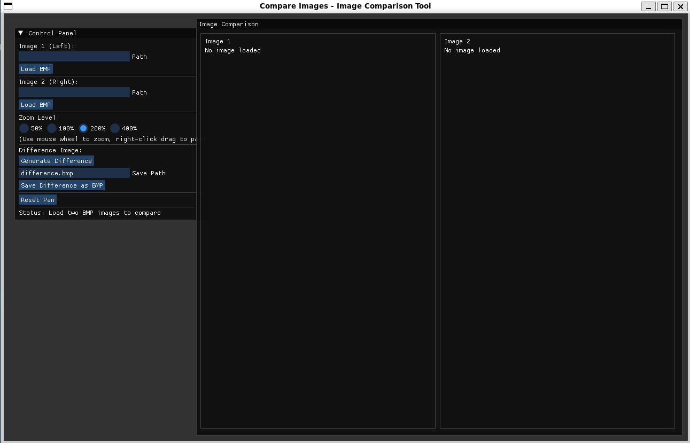

# Compare Images - Image Comparison Tool

A powerful image comparison application built with SFML and ImGui that allows you to compare two images side-by-side with synchronized viewing and generate difference images.



## Features

### Basic Functionality
- **Load and Display BMP Images**: Load two BMP images and view them side by side
- **Split View**: Images displayed with a vertical divider for easy comparison
- **Synchronized Zoom**: Zoom both images together with preset levels (50%, 100%, 200%, 400%)
- **Synchronized Panning**: Pan both images simultaneously when zoomed in
- **Difference Image**: Generate an absolute RGB difference image
- **Export Results**: Save the difference image as a BMP file

### Controls
- **Zoom**: 
  - Click radio buttons (50%, 100%, 200%, 400%)
  - Use mouse wheel to zoom in/out
- **Pan**: Right-click (or middle-click) and drag to move both images together
- **Reset**: Click "Reset Pan" button to return to default view position

## Building the Project

### Prerequisites

**Build Tools:**
- C++20 compatible compiler (gcc, clang, or MSVC)
- **uv** (required by build and setup scripts) - [Installation Guide](https://docs.astral.sh/uv/)
- Meson build system (≥ 1.3.0)
- Ninja build backend
- CMake (used by some subproject dependencies)
- pkg-config

**System Libraries (required by SFML):**
- X11 development libraries (Linux)
- OpenGL development libraries
- Audio libraries (ALSA/PulseAudio on Linux)
- Freetype development libraries

**Managed Dependencies (automatically downloaded by Meson):**
- SFML 3.0.1
- ImGui 1.91.6
- ImGui-SFML 3.0
- miniaudio 0.11.22

**Optional Tools:**
- **ImageMagick** (for converting images to BMP format)

#### Installing System Dependencies

On Ubuntu/Debian:
```bash
sudo apt install build-essential meson ninja-build cmake pkg-config \
  libx11-dev libxrandr-dev libxcursor-dev libxi-dev libudev-dev \
  libgl1-mesa-dev libopenal-dev libvorbis-dev libflac-dev \
  libfreetype-dev
```

On Arch Linux:
```bash
sudo pacman -S base-devel meson ninja cmake pkgconf \
  libx11 libxrandr libxcursor libxi systemd mesa openal \
  libvorbis flac freetype2
```

On macOS:
```bash
brew install meson ninja cmake pkg-config
```

### Build Instructions

1. Clone the repository:
```bash
git clone <repository-url>
cd compare-images-inator
```

2. Run the build script:
```bash
./build.sh
```

3. The executable will be created at:
```bash
build/compare-images-inator
```

## Usage

### Running the Application
```bash
./build/compare-images-inator
```

### Loading Images

1. **Load First Image**:
   - Enter the file path in the "Image 1 (Left)" text field
   - Click the "Load BMP" button
   - Image dimensions will be displayed

2. **Load Second Image**:
   - Enter the file path in the "Image 2 (Right)" text field
   - Click the "Load BMP" button
   - Image dimensions will be displayed

### Comparing Images

1. Use the zoom controls to adjust magnification:
   - Select 50%, 100%, 200%, or 400%
   - Or use mouse wheel for quick zooming

2. Pan the images:
   - Right-click and drag to move both images synchronously
   - Useful when zoomed in and images exceed viewport size

3. Reset view:
   - Click "Reset Pan" to return to original position

### Generating Difference Images

1. Load both images first
2. Click "Generate Difference" button
3. A popup window will appear showing the difference image
4. The difference is calculated as the absolute value of RGB component differences

### Saving Difference Images

1. Generate a difference image first
2. Enter desired filename in "Save Path" field (default: `difference.bmp`)
3. Click "Save Difference as BMP"
4. The file will be saved to the specified path

## Converting Images to BMP

If you have images in other formats (JPEG, PNG, etc.), convert them to BMP first using **ImageMagick**:

### Install ImageMagick

On Ubuntu/Debian:
```bash
sudo apt install imagemagick
```

On macOS:
```bash
brew install imagemagick
```

### Convert Images

```bash
convert input.jpg output.bmp
convert example.jfif example.bmp
convert image.png image.bmp
```

## Project Structure

```
compare-images-inator/
├── src/
│   └── main.cpp           # Main application code
├── build/                 # Build output directory
├── subprojects/           # Dependencies (ImGui, SFML, etc.)
├── specification/         # Project specification document
├── meson.build           # Build configuration
├── build.sh              # Build script
└── README.md             # This file
```

## Technical Details

### Image Processing
- **Difference Calculation**: For each pixel, the absolute difference is computed for each RGB channel:
  ```
  R_diff = |R1 - R2|
  G_diff = |G1 - G2|
  B_diff = |B1 - B2|
  ```
- **Different Sizes**: When images have different dimensions, the smaller dimensions are used

### Performance
- Hardware-accelerated rendering using SFML
- Efficient texture management
- 60 FPS frame limit for smooth operation

## Troubleshooting

### "No such file or directory" Error
- Verify the file path is correct
- Use absolute paths or paths relative to the executable
- Ensure the file exists and has read permissions

### "Failed to load image" Error
- Confirm the file is a valid BMP format
- Check that the file is not corrupted
- Try converting the image using ImageMagick or similar tools

### "Setting vertical sync not supported" Warning
- This is a benign warning on some systems
- The application will function normally despite this message

## License

See project specification for details.

## Authors

Project developed according to specification document 17: "Porównywanie obrazów" (Image Comparison).
